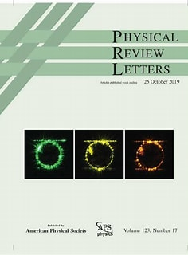
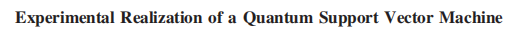
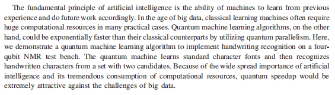
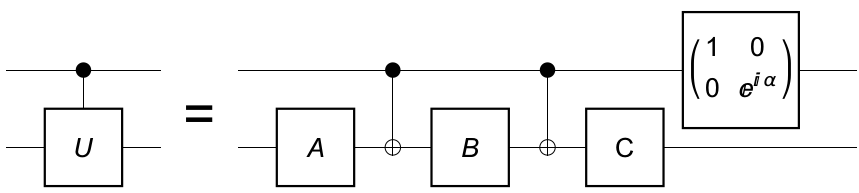
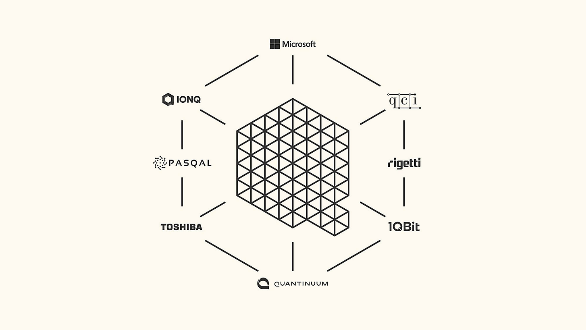

# quantum_code

## 环境

青果语言：[Quingo-runtime: Quingo编程框架的运行时系统，可提供使用Quingo进行量子-经典异构编程的能力。 该编程框架组织、管理系统可用的量子-经典计算资源。量子计算物理系统或量子模拟器可通过继承相关类接入此框架中。 (gitee.com)](https://gitee.com/quingo/quingo-runtime)

quingo的库中有传统计算机模拟量子环境的包

量子计算云平台：[量子计算云平台 (quantumcomputer.ac.cn)](https://quantumcomputer.ac.cn/index.html)

部署了部署了quingo和qcis两种编程语言，底层指令集用的是GCIS，提供12bit的真量子计算机，但是用的人很多，需要排队，推荐用模拟环境

## 论文来源和作者详情信息

Experimental Realization of a Quantum Support Vector Machine

### 论文来源

《物理评论快报》为中科院1区期刊，JCR分区为Q1，2022年的影响因子为9.185.

### 作者详情
&emsp;&emsp;本文由中国科学技术大学合肥微尺度物理科学国家实验室和近代物理系和中国科学技术大学量子信息与量子物理协同创新中心的李兆凯,刘晓梅,徐南阳,杜江峰所写。  

- 李兆凯  
  中国科学技术大学副研究员。从事基于自旋共振的量子计算与量子模拟的实验研究工作多年，在磁共振量子操控上有着丰富的实验经验，取得了量子人工智能算法实现手写识别、压缩量子模拟、量子化学基态问题、线性方程组求解等一系列重要的科学研究成果，相继发表于国际知名SCI期刊 Nature Physics (1篇)、Science Advances（1篇）、Physics Review Letters（6篇)等杂志上。目前主要研究方向为机器学习与量子计算的交叉，探索实用新型量子算法，在自旋量子计算体系上运行量子机器学习算法，展现出其解决人工智能问题的能力。

- 杜江峰  
  中国科学院院士，中国科学技术大学教授， 教育部长江学者特聘教授，国家杰出青年科学基金获得者，国家重大科学研究计划项目首席科学家，首批国家万人计划“中青年科技创新领军人才”入选者，新世纪百千万人才工程国家级人选。长期从事量子物理及其应用的实验研究，是国际上自旋量子计算和模拟、量子精密测量实验研究方面有突出贡献的学者之一，在包括 Science (3篇)、Nature (2 篇)、Nature 子刊(13 篇)、Phys. Rev. Lett. (34 篇)在内的国际学术期刊上发表论文 200余篇，SCI 他引 5200 余次。

- 徐南阳  
  黄山青年学者”教授，理学博士，2012年毕业于中国科学技术大学，博士毕业后留任中国科学技术大学物理学院特任副教授。主要研究方向为基于电子自旋的控制和探测技术，量子计算机体系架构，量子算法等。曾在国际顶级物理学杂志Phys.Rev.Lett.（物理评论快报）上发表7篇研究论文（其中三篇为第一或通讯作者），涵盖绝热量子算法，量子模拟，量子人工智能等方面。

### 题目

> 量子支持向量机的实验实现

### 摘要

> 人工智能的基本原理是机器从以前的经验中学习并相应地做未来工作的能力。在大数据时代，经典学习机在很多实际案例中往往需要巨大的计算资源。另一方面，通过利用量子并行性，量子机器学习算法可以比经典算法快出指数级。在这里，我们演示了一个量子机器学习算法，在一个4个量子比特的NMR测试台上实现手写识别。量子机器学习标准字符字体，然后从一组有两个候选字符的字符中识别手写字符。由于人工智能的广泛重要性及其对计算资源的巨大消耗，量子加速在面对大数据的挑战时将极具吸引力。

1. 介绍背景：

   The fundamental principle of artificial intelligence is the ability of machines to learn from previous experience and do future work accordingly.

2. 表明现在领域中的问题也是提出本论文尝试解决或者探索的问题：

   In the age of big data, classical learning machines often require huge computational resources in many practical cases.

3. 转折提出解决方式（on the other hand）：

   The fundamental principle of artificial intelligence is the ability of machines to learn from previous experience and do future work accordingly. In the age of big data, classical learning machines often require huge computational resources in many practical cases.

4. 具体实验步骤，论文具体内容：

   The fundamental principle of artificial intelligence is the ability of machines to learn from previous experience and do future work accordingly. In the age of big data, classical learning machines often require huge computational resources in many practical cases.

5. 重申量子计算的重要性和前景：

   The fundamental principle of artificial intelligence is the ability of machines to learn from previous experience and do future work accordingly. In the age of big data, classical learning machines often require huge computational resources in many practical cases.

   >NMR test bench
   >
   >Nuclear Magnetic Resonance (NMR) spectroscopy measurements
   >
   >核磁共振(NMR)波谱测量

## 量子计算基础

### 量子态

量子态是描述量子系统的状态，不同于经典物理态，它满足和经典物理态本质上不同的量子态叠加原理。即如果一个量子力学系统态可能是$\lvert \psi_1 \rangle$,也可能是$\lvert \psi_2\rangle$，在保持态$\lvert \psi\rangle$不被破坏的情况下，没有任何物理方法能确定$\lvert \psi\rangle$处于那种状态，即这时系统处于两个态的叠加态。
$$
\lvert \psi \rangle=\alpha \lvert \psi_1 \rangle+\beta\lvert \psi_2\rangle
$$

$\alpha$、$\beta$是两个复常数，它们描述了系统以一定的概率（幅）处在其中每个态上。假设$\lvert \psi_1\rangle$、$\lvert \psi_2\rangle$互相正交，并且都已归一化，波函数$\lvert\psi\rangle$满足归一化条件要求$\lvert \alpha\rvert ^2+\lvert \beta\rvert ^2=1$。

##### 举例

一个通俗易懂的例子是猫的状态。在经典物理中，一只猫可以处于两种状态中的一种，比如说它要么是活的，要么是死的。但在量子力学中，猫可以同时处于两种状态之间的叠加态，既不完全活的，也不完全死的。这种状态被称为叠加态，这是量子力学的基本原理之一。

##### 量子叠加态与经典状态的区别

在经典计算机中，使用两个二进制位（即0和1）可以表示四种不同的状态：00、01、10和11。但经典比特只能处于这四个状态中的一个，无法同时处于多个状态之间的叠加态。

而在量子计算机中，使用两个量子比特可以制备出四个态的叠加态，这四种不同的信息（或数据）以一定的概率同时存在于叠加态中。换句话说，量子比特可以同时处于多个状态之间的叠加态，这是量子计算机的一项关键特性。

这种叠加态的概念是量子力学的基本原理之一。在经典物理中，一个系统只能处于一种确定的状态，而在量子物理中，一个系统可以同时处于多个状态之间的叠加态。

##### 量子叠加态与经典波叠加态的区别

对于量子叠加态，当我们对其进行测量时，测量结果是排他的，只能得到其中一个态，即一个态的存在意味着另一个不存在。并且，每次测量一个成分态都会破坏它，“坍缩”到实际测量得到的那个成分态上，无法再次利用。因此，要确定叠加态中所有成分的概率，需要对一批与叠加态完全相同的态进行多次独立的测量，每次测量都会得到其中一个成分态，而其他成分态的概率则由叠加系数的模方$\lvert\alpha\rvert^2$、$\lvert\beta\rvert^2$给出。

相比之下，经典波叠加态中的每个成分都是系统的一个实际存在的态，可以通过反复测量得到各种成分。

此外，对于量子叠加态中的两个相同态的叠加，其在物理上表示同一个量子态，而不是幅度增大一倍的新态。

#### 量子位（量子比特）

在量子信息学中把两个线性独立状态的量子力学系统称为一个**量子位（qubit）**，其是量子计算机中的一个最小的存储单元。记一个量子位的两个线性独立态为**$\lvert0\rangle$**、**$\lvert1\rangle$**，根据态叠加原理，量子位可以处在叠加态：
$$
\lvert\psi\rangle=\frac{1}{\sqrt2}(\lvert0\rangle+\lvert1\rangle)
$$
$\lvert0\rangle$、$\lvert1\rangle$各以相等的几率出现，所以$\lvert\psi\rangle$既包含$\lvert0\rangle$的信息，也包含$\lvert1\rangle$的信息。

##### 一个物理系统能够实现（充当）一个量子位的条件

1. 存在经典上互相排斥（互相正交）的两个态，分别编码为$\boldsymbol{ \vert 0\rangle}$（0态）、$\boldsymbol{ \vert 1\rangle}$（1态）
2. 能够制备系统处在这两个态的叠加态。即在保持态$\vert \psi\rangle$不被破坏的情况下，没有任何物理方法可以确定或区分在这个态中系统究竟处在$\vert 0\rangle$态或$\vert 1\rangle$态。

量子计算机的基本操作是对量子比特的叠加态进行操作，而这些操作可以同时作用于多个状态，这使得量子计算机可以在某些情况下比经典计算机更高效地完成某些计算任务。

##### 量子计算机计算举例

我们假设有10个比特（即10位），那么从00 0000 0000到11 1111 1111之中，0和1的排列方式会有$2^{10}$（1024）种，但比特每次只能表示其中的一种排列（信息）。**因为量子比特可以同时表示0和1，所以10量子比特通过叠加可以同时表示1024种排列**。在叠加态下进行计算，就可以同时计算全部1024种排列。例如，用量子比特表示的1～1024乘某个数时，计算次数不是1024次，而是1次就能完成。

**量子计算机的计算效率会随着量子比特数量的增加而呈指数增长**。例如，有10个量子比特，可以同时计算$2^{10}$（1024）种排列；如果有30个量子比特，则可以同时计算$2^{30}$（1073741824）种排列。**量子比特的数量是X，那么一次就可以同时计算$\boldsymbol {2^X}$种排列。**

### 量子编码

#### 为什么用少量量子比特就能编码较大量的数据？

### 量子门电路

&emsp;&emsp;谈论量子计算时，我们谈的是n个二态系统(qubit) ，对其执行一系列算符操作，最后执行测量。如下图，我们常常画出横着并排的n条直线，从左到右代表着时间顺序，而不同的直线代表不同的 qubit ；在这些直线上排列着各种小方块大方块还有竖线，代表着各种不同的单 qubit 或多 qubit 幺正算符，每一个幺正算符被称为一个（量子）门；人们常将一些简单的量子门组合成更复杂的量子门；整张图就被称为一个量子网络/量子电路。     
  

> 一个典型的量子电路  

&emsp;&emsp;人们给一些常用的量子门取了特定的名字，如：

- $\sigma_x$门：  
  
X= $\begin{pmatrix} 0&1\\
1&0\\
\end{pmatrix}$   
即在单 qubit 上作用算符$\sigma_x$翻转（简单起见，以后均记做X），相当于经典中的非门。同理，还有Z门和Y\ 门。

- Hadamard 门：  
   
H=$\frac{1}{\sqrt 2} \begin{pmatrix} 1&1\\
1&-1\\
\end{pmatrix}$  
这也是一种单 qubit 门。  

- 控制非(Controlled-NOT, CNOT)门：  
  %E9%97%A8.jpg "控制非(Controlled-NOT, CNOT)门")    
  这是一个双 qubit 门，若控制位（图中带黑点的线路）为1，则翻转受控制位（图中带十字圆圈的线路），否则不执行操作；而控制位自身始终不动。

- 控制U\ 门：
前面我们介绍了控制非门，控制位为1则加$\sigma_x$
到受控位，一个很自然的想法是，能不能推广到如果控制位为1则加任意U
到受控位？  
为了实现这个推广，我们需要如下定理：  
> 设U
为单 qubit 上的任意幺正算符。存在单 qubit 上的幺正算符A,B,C
使得：ABC=I且U=$e^{i\alpha}AXBXC$，其中$\alpha$是某个整体的相因子。

有了这个定理，我们便可以很容易看出，下图所示的电路实现了我们所想要的控制U
门：当控制位为0时，受控位作用ABC=I
相当于没作用；而当控制位为1时，受控位作用AXSXC
，再加上一个整体的相位$e^{i\alpha}$
正好就是U。  
  

- Toffoli 门：  
对于 CNOT 门另外一个推广的想法是，能不能实现两个门控制一个门？也就是说逻辑与操作能不能做？利用如下这个简单的事实：
> 任意幺正算符是可以开根号的，即对于任意幺正算符U\ 
，存在幺正算符V\ 
，使得$V^2=U$。  

具体电路实现见下图:  
  
控制端00输入时，什么门都没有触发，不用管；01输入时，给受控位触发两个门，和效果为零；10输入时，二号控制位翻转，触发$V^+$
，自身再翻转，一号控制位触发V
，和效果为零；11输入时，二号控制位触发V
，翻转两次，一号控制位触发V
，最后总效果为一个U
（在做这些讨论时，始终要记住我们是对一个一般的量子态进行操作，也就是说上面这些情况是可以相干地同时发生的。)。综上，我们实现了预期的功能。当U
取做翻转门X时，我们一般将其称为 Toffli 门。

### 量子计算的指数加速

指数加速（exponential speedup）是计算机科学中的一个概念， 指的是量子算法能够比已知的最优经典算法更快地解决某个问题。
>例如，Shor算法是一种量子算法，可以在指数级别的速度比最优经典算法——通用数域筛（GNFS）更快地分解大整数。这意味着随着要分解的整数的大小增加，GNFS所需的时间呈指数级增长，而Shor算法所需的时间呈多项式级增长。

**指数加速是通过利用量子电路并行计算向量的内积来实现的，并将SVM训练转换为近似最小二乘问题，随后由量子矩阵反演算法解决。**
指数加速是量子计算的重要优势之一，因为它意味着在某些情况下，量子计算机可以解决传统计算机难以解决的问题。这是因为量子计算机利用量子叠加和量子纠缠等量子现象，可以在一次计算中处理多个状态，从而在某些情况下大大缩短解决问题所需的时间。

#### 量子计算的并行加速和GPU的并行加速的区别

1. 首先，量子计算的并行加速是基于量子叠加和量子纠缠等量子现象实现的。在量子计算中，量子比特可以处于多个状态的叠加态中，这使得量子计算机可以在一次计算中处理多个状态，从而实现并行加速。 
而GPU的并行加速是利用GPU的大量核心和线程来处理并行任务，将任务分配到多个核心和线程上同时执行。
>例如，一个2比特量子计算机可以同时表示00、01、10和11四个状态。这意味着在一个量子计算机中，可以同时执行多个操作，即并行计算。

2. 其次，量子计算的并行加速通常适用于一些特定的问题，例如量子化学、优化问题等。而GPU的并行加速可以应用于各种计算任务，例如图像处理、机器学习等。
3. 另一个区别是，GPU的并行加速通常是基于经典计算机的体系结构实现的，相对于bit位数有线性加速，如果8bit并行处理，则加速8倍，而量子计算的并行加速是基于量子计算机的体系结构实现的，相比于量子比特数有指数加速，如果8bit并行处理，则加速$2^8$。
由于量子计算机的体系结构和经典计算机有所不同，因此量子计算的并行加速需要采用不同的算法和技术。
例如，在量子并行算法中，可以使用Grover搜索算法和Shor算法等来实现并行加速，而在GPU并行算法中，可以使用CUDA和OpenCL等技术来实现并行加速。

4. 此外，由于量子计算机的特殊性质，例如量子比特之间的干涉和纠缠，实现量子算法时需要考虑这些因素，这使得量子计算的并行加速与传统计算的并行加速有一些不同的技术挑战和难点。

总的来说，量子并行计算是通过利用量子叠加态的并行性来实现加速的。这种并行计算方式是传统计算机无法实现的，因此可以为某些问题提供相对于传统计算机更快的解决方案。

量子计算的并行加速和GPU的并行加速都是计算领域中的重要技术，它们分别基于不同的体系结构和算法，具有不同的优势和适用范围。在实际应用中，我们可以根据具体的问题和需求选择合适的技术来实现并行加速，以提高计算效率和速度。

### 量子编程环境

| 量子计算平台                                                 | 量子编程语言/sdk                                             | 文档                                                         | 对接传统语言                             | 备注                                                         |
| ------------------------------------------------------------ | ------------------------------------------------------------ | ------------------------------------------------------------ | ---------------------------------------- | ------------------------------------------------------------ |
| [科大国盾](https://quantumcomputer.ac.cn/index.html) | quingo isq-core | [Quingo (gitee.io)](https://quingo.gitee.io/docs/) [安装和使用 - isQ-core python包使用文档 (arclightquantum.com)](http://www.arclightquantum.com/isq-core/) | quingo: python/C++ isq-core: python | 底层指令集为qcis VSCode中有quingo和isq-core的插件支持 注意isq和isq-core不同,只有isq-core对接了qcis指令集 quingo同时支持eQASM指令集和QCIS指令集 isq-core只支持eQASM 该平台目前只开放12比特的量子计算机,支持图形化搭建量子门电路 |
| [Azure Quantum - 量子云计算服务  Microsoft Azure](https://azure.microsoft.com/zh-cn/products/quantum/) | Q#   | [Q# 程序的运行方式 - Azure Quantum  Microsoft Learn](https://learn.microsoft.com/zh-cn/azure/quantum/user-guide/host-programs?tabs=tabid-python) [Qiskit documentation](https://qiskit.org/documentation/) [Cirq Google Quantum AI](https://quantumai.google/cirq) | python                                   |                                                              |
| [Quantum Lab - IBM Quantum](https://quantum-computing.ibm.com/lab) |  | [Qiskit documentation](https://qiskit.org/documentation/)    | python                                   | 进入该平台时不科学上网会报错                                 |
| [Google Quantum AI](https://quantumai.google/) |    | [Google Quantum AI](https://quantumai.google/)               | python                                   |                                                              |
|                                                              |  | [TorchQuantum - Quantum ML System (mit.edu)](https://qmlsys.mit.edu/torchquantum/) | python                                   |                                                              |

## 题目

Quantumn Graph Neural Networks based Graph Representation

## 摘要

1. 背景：GAT（Graph Attention Network）是一种用于处理图结构数据的神经网络模型。与传统的图神经网络模型不同，GAT采用了注意力机制来对节点进行加权聚合，从而更好地捕捉节点之间的关系。
2. 当前领域痛点或者需要解决的问题：然而，GAT在获得更好的特征提取效果的同时，注意力机制导致了训练速度慢的问题
3. 我们提出的解决方法：本文利用

## References

[1]Yao Zhang, Qiang Ni, Recent advances in quantum machine learning, Quantum Engineering, 10.1002/que2.34, 2, 1, (2020).

[2]Shor PW. 1997 Polynomial-time algorithms for prime factorization and discrete logarithms on a quantum computer. SIAM J. Comput. 26, 1484–1509. (doi:10.1137/S0097539795293172) Crossref, ISI, Google Scholar

[3]Van Dam W, Hallgren S, Ip L. 2006 Quantum algorithms for some hidden shift problems. SIAM J. Comput. 36, 763–778. (doi:10.1137/S009753970343141X) Crossref, ISI, Google Scholar

[4]Hallgren S. 2007 Polynomial-time quantum algorithms for Pell’s equation and the principal ideal problem. J. ACM 54, 4. (doi:10.1145/1206035.1206039) Crossref, ISI, Google Scholar

[5]黄一鸣, 雷航, 李晓瑜. 量子机器学习算法综述[J]. 计算机学报, 2018, 41(1): 145-163.

[6]Peruš M. Neuro-quantum parallelism in brain-mind and computers[J]. Informatica, 1996, 20: 173-183.

[7]Kak S (1995) On quantum neural computing. Inf Sci 83:143–163

[8]Menneer T (1998) Quantum artificial neural networks. PhD thesis, University of Exeter

[9]Ventura D, Martinez T (2000) Quantum associative memory. Inf Sci 124(1–4):273–296

[10]Kouda N, Matsui N, Nishimura H, Peper F (2003) Qubit neural network and its efficiency. In: International 
conference on knowledge-based and intelligent information and engineering systems, pp 304–310

[11]Zhou R, Zheng HY, Jiang N, Ding Q (2006) Self-organizing quantum neural network. In: Neural networks, 2006. IJCNN’06. International joint conference on IEEE, pp 1067–1072

[12]de Paula Neto F M, da Silva A J, Ludermir T B, et al. Analysis of quantum neural models[C]//Proceedings of the Congresso Brasileiro de Inteligência Computacional—CBIC. 2013.

[13]Abbas A, Sutter D, Zoufal C, et al. The power of quantum neural networks[J]. Nature Computational Science, 2021, 1(6): 403-409.

## Introduction 汇报

Graph neural network initialisation of quantum approximate optimisation
