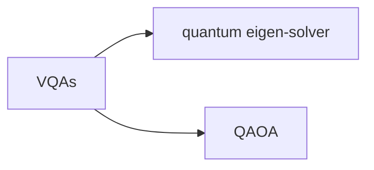

# Introduction

## 案例分析

### 专有名词

#### quantum approximate optimisation algorithm(**QAOA**)

量子近似优化算法

#### noisy intermediate-scale quantum (**NISQ**)

含噪声的中尺度量子

NISQ 是一种介于传统计算机和完全功能的量子计算机之间的计算机类别。

NISQ 设备通常由几十个量子比特组成，这些量子比特可能无法被完全控制，且受到环境噪声和其他干扰的影响，可能会导致计算结果的错误。因此，NISQ 设备上的计算通常需要采用特殊技术和算法来纠正错误和优化性能。

#### variational quantum algorithms (**VQAs**)

变分量子算法

VQA是一种基于量子计算机的算法，用于解决经典计算机无法高效处理的问题。

VQA主要用于<u>求解优化问题</u>。VQA使用一个特殊的量子电路来构造一个量子状态，并使用经典计算机来优化电路参数，以获得最小化成本函数的量子态。这样，VQA可以在量子计算机上使用相对较少的量子比特来解决一些经典计算机上难以处理的问题。

可以将VQA看作是一个<u>优化问题的求解器</u>，它利用量子计算机强大的并行处理能力，在“量子空间”中搜索最优解。

#### quantum eigen-solver

量子特征值求解器

是一种基于量子计算的算法，用于求解量子系统的特征值和特征向量。特征值和特征向量是量子系统的重要属性，对于量子计算、量子模拟和量子化学等领域具有重要意义。

在经典计算机中，求解特征值和特征向量的过程通常需要非常复杂和耗时的计算。但是，量子计算机可以通过利用量子<u>并行性质</u>来加速这个过程。量子特征值求解器的基本思想是<u>将量子系统的特征值和特征向量表示为量子态，并使用量子算法来找到这个态</u>。然后，<u>通过测量这个态，可以得到目标系统的特征值和特征向量</u>。

#### parameterised quantum circuit (PQC)

参数化量子电路

是一种基于量子比特的电路，其中电路中的参数是可变的，并且可以通过优化来获得最优解。

PQC通常由一些基本的量子门组成，例如Hadamard门、CNOT门和旋转门等等。这些量子门中的参数是可变的，可以通过调整这些参数来改变电路的行为。在PQC中，这些参数通常被看作是一个向量，称为参数向量，可以通过经典优化算法来优化。

PQC的优点之一是它比一般的量子电路更容易实现。因为PQC的参数是可变的，可以通过简单的调整来适应不同的应用。此外，PQC还可以在不同的量子计算平台上进行实现，因为它不需要太多的硬件资源。然而，PQC的实现也面临着一些挑战，如参数的数量和复杂度，以及参数优化的精度和效率等等。

#### NP-Hard

NP-Hard是计算机科学中的一个概念，指的是一类在多项式时间内无法求解的问题。

NP-Hard问题是一类最难求解的问题，因为它们需要在指数级时间内计算出最优解，而这在实际中通常是不可行的。虽然这些问题在多项式时间内无法求解，但有时候可以使用启发式算法或近似算法来得到可行解或接近最优解。

#### semi-definite programming (SDP)

半定规划

半正定指的是矩阵的特征值都非负。

SDP是一种优化问题，它的目标是在满足一些线性约束的情况下，寻找一个矩阵，使得这个矩阵是半正定的并且满足一定的目标函数要求。

#### trotterised quantum annealing (TQA)

TQA是一种量子计算方法，它将量子模拟和量子退火结合起来，用于解决优化问题。

在TQA中，优化问题可以被编码成一个哈密顿量，然后通过“退火”（annealing）的过程来找到最小能量状态。

TQA采用了Trotter分解方法，将哈密顿量分解为若干小的部分，每个部分都可以通过量子门操作来模拟。这种分解可以减少量子门操作的数量，使得TQA可以在更少的量子比特和更短的时间内解决更大规模的优化问题。

#### APX-hard

当我们面对一个优化问题时，我们希望找到一个最优解，但在许多情况下，找到最优解是不可行的，因为它需要非常长的时间。因此，我们经常使用近似算法来找到一个接近最优解的解决方案。

APX-hard问题是这样一类问题，它们被证明是非常难以近似的。具体来说，如果一个问题被证明是APX-hard，那么我们不能在多项式时间内找到一个近似比例为常数的算法，这意味着我们不能在合理的时间内找到一个非常接近最优解的解决方案。在这种情况下，我们通常需要使用一些启发式算法或者近似算法来找到一个次优解。

例如，最大独立集问题就是一个APX-hard问题。这个问题是指给定一个图，找到一个最大的没有相邻节点的节点集合。这个问题被证明是非常难以近似的，因此我们通常需要使用一些启发式算法或者近似算法来找到一个次优解。

#### NP-hard与APX-hard

| 概念     | 定义                                                         | 问题类型             |
| :------- | ------------------------------------------------------------ | -------------------- |
| NP-hard  | 需要在非确定性多项式时间内可解的问题，但不一定要求找到最优解，但要求能够在多项式时间内验证解的正确性。 | 最优化问题或决策问题 |
| APX-hard | 难以在多项式时间内获得一个近似比例为常数的算法的优化问题。即，不存在一个多项式时间算法能够在该问题的最优解与其近似解之间给出一个比例小于该常数的保证。 | 最优化问题           |

### 段落分析

#### Para1

Among the forerunners for use cases of near-term quantum computers, dubbed noisy intermediate-scale quantum (NISQ) [1] are the variational quantum algorithms (VQAs). The most well known of these is the variational quantum eigensolver [2] and the quantum approximate optimisation algorithm (QAOA) [3]. In their wake, many new algorithms have been proposed in this variational framework tackling problems in a variety of areas [4–6]. The primary workhorse in such algorithms is typically the parameterised quantum circuit (PQC), and due to the heuristic and trainable nature of VQAs they have also become synonymous with ‘modern’ quantum machine learning [7]. This is particularly evident with the adoption of PQCs as the quantum version of neural networks [8, 9].

##### 本段要点

- 变分量子算法（VQA）是近期嘈杂的中间规模量子计算机（NISQ）使用案例之一。
- VQA包括变分量子特征值求解器和量子近似优化算法（QAOA）。
- 在变分框架中提出了许多新算法，解决各个领域的问题。
- 在这些算法中，主要的工作是参数化量子电路（PQC）。
- 由于PQC的启发式和可训练性质，VQA已经成为现代量子机器学习的代名词。
- PQCs已被采用作为量子神经网络的实现方式。

##### 本段分析

由近期量子计算机用例的先驱NISQ引出，概括了量子计算的大背景，进一步指出这种框架下的多种算法。

#### Para2

In this work, we focus on one particular VQA- the QAOA - primarily used for approximate
discrete combinatorial optimisation. The canonical example of such a problem is finding the
‘maximum cut’ (Max-Cut) of a graph, where (for an unweighted graph) one aims to partition the
graph nodes into two sets such that the sets have as many edges connecting them as possible.
Discrete optimisation problems such as Max-Cut are extremely challenging to solve (specifically
NP-Hard) and accurate solutions to such problems take exponential time in general. Aside from its theoretical relevance, Max-Cut finds applications across various fields such as study of the spin glass model, network design, VLSI and other circuit layout designs [10], and across data clustering [11]. While it is not believed quantum computers can solve NP-Hard problems efficiently [12], it is hoped that quantum algorithms such as QAOA may be able to outperform classical algorithms by some benchmark. Given the
ubiquity of combinatorial optimisation problems in the real world, even incremental improvements may have large financial and quality impacts.

##### 本段要点

- 本篇文章关注一种特定的变分量子算法（VQA），即量子近似优化算法（QAOA）。
- QAOA主要用于近似离散组合优化问题，其中一个经典例子是在一个无权图中找到最大割（Max-Cut）问题，即将节点分为两个集合，使它们之间的边数最大。
- 离散优化问题（如Max-Cut）通常很难求解，而且通常是NP-Hard问题，精确解决这些问题通常需要指数级时间。
- Max-Cut在自旋玻璃模型、网络设计、VLSI和其他电路布局设计、数据聚类等领域中有广泛应用。
- 虽然人们认为量子计算机不能有效地解决NP-Hard问题，但希望量子算法（如QAOA）能够在某些基准下超越经典算法。
- 组合优化问题在现实世界中非常普遍，即使是渐进式的改进也可能会对财务和质量产生巨大影响。

##### 本段分析

提出本篇文章所关注的领域——VQA- the QAOA - primarily used for approximate
discrete combinatorial optimisation，并针对这一领域提出存在的NP-Hard问题，表明QAOA所具有的解决这类问题的潜力，表现出其巨大的发展空间。

#### Para3

Due to this potential, there has been a rapid development in the study of the QAOA algorithm and its components, including (but not limited to) theoretical observations and limitations [13–20], variations on the circuit structure (ansatz) [21–25] used, the cost function [26–28] and initialisation and optimisation methods [29–34] used for finding optimal solutions. Since the algorithm is suitable for near-term devices, there has also been substantial progress in experimental or numerical benchmarks [34–38] and the effect of quantum noise on the algorithm [39, 40].

##### 本段要点

- QAOA算法具有巨大的潜力，因此近年来对该算法及其组成部分进行了快速发展，包括理论观察和限制、电路结构（ansatz）的变化、成本函数、初始化和优化方法等。

##### 本段分析

举例了领域内的已有研究。

#### Para4

However, due to the limitations in running real experiments on small and unreliable NISQ devices, which currently are typically only accessi-ble via expensive cloud computing platforms [41], it is important to limit the quantum resource (i.e. the overall number of runs, or the time for a single run on quantum hardware) required to solvea problem to the bare minimum. Therefore, effective initialisation and optimisation strategies for VQAs can dramatically accelerate the search for optimal problem solutions. The former ensures the algorithm begins ‘close’ to a solution in the parameter space (near a local or global
optimum), while the latter enables smooth and efficient traversal of the landscape. This is especially relevant given the existence of difficult optimisation landscapes in VQAs plagued by barren plateaus [42–45], local minima [46, 47] and narrow gorges [48]. To avoid these, and to enable efficient optimisation, several initialisation technique have been proposed for VQAs, including using tensor networks [49], meta-learning [50–52] and algorithm-specific techniques [29, 30].

##### 本段要点

- NISQ设备受限，只能通过昂贵的云计算平台访问，因此需要最小化使用量子资源来解决问题。
- 有效的初始化和优化策略可以显著加速寻找最优问题解决方案的过程。
- VQA中存在困难的优化空间，因此需要避免荒凉高原、局部极小值和狭窄峡谷等问题。
- 针对VQA提出了几种初始化技术，包括使用张量网络、元学习和算法特定技术。这些技术可以使得使用最少的量子资源来解决问题。

##### 本段分析

根据领域目前的发展状况提出存在的痛点，并补充了已有的解决问题的技术，进而过渡到下面对本文研究目标重要性的描述。

#### Para5

Returning to the specifics of combinatorial optimisation, the use of machine and deep learning has been shown to be effective means of solving this family of problems, see for example Refs. [53–56]. Of primary interest for our purposes are the works of [53, 56]. The former [53] trains a graph neural network (GNN) to solve Max-Cut, while the latter [56] extends this to more general optimisation problems, and demonstrates scaling up to millions of variables. Based on these insights and the recent trend in the quantum domain of incorporating VQAs with neural networks (with software libraries developed for this purpose [57, 58]) indicates that using both classical and quantum learning architectures synergistically has much promise. Weextend this hybridisation in this work.

##### 本段要点

- 机器学习和深度学习已经被证明是解决组合优化问题的有效手段。
- 本文主要关注53号和56号文献的工作，前者使用图神经网络（GNN）解决最大割问题，后者将其扩展到更一般的优化问题，并展示了可扩展到数百万个变量的规模。
- 最近在量子领域中，将VQA与神经网络相结合的趋势，使用专门为此目的开发的软件库，表明同时使用经典和量子学习架构具有很大的潜力。
- 本文将进一步发展这种混合方法。

##### 本段分析

通过对先前结论的研究，表明了本文工作的巨大前景，为本文所提出的方法进行铺垫。

#### Para6

This paper is divided into two parts. In the first part (Sections 2-4), we discuss the previous works in QAOA initialisation and give our first contribution: an initialisation strategy using graph neural networks. Specifically, we merge GNN solvers with the warm-starting technique for QAOA of [29], and demonstrate the effectiveness of this via numerical results in Section 4. By then examining the conclusion of [56], we can see how our GNN approach would allow QAOA initialisation to scale far beyond the capabilities of current generation near-term quantum devices. In the second part of the paper(Section 5), we then complement this by evaluating several methods of optimisation techniques for the QAOA proposed in the literature, including quantum-aware, quantum-agnostic and neural network based optimisation approaches.

##### 本段要点

- 本文分为两个部分，第一部分（第2-4节）讨论了QAOA初始化的先前工作，并提出了使用图神经网络的初始化策略。将GNN求解器与QAOA的[29]暖启动技术结合起来，并在第4节通过数值结果展示了这种方法的有效性。
- 通过检查[56]的结论，可以看到本文的GNN方法将使QAOA初始化能够扩展到远远超出当前近期量子设备能力的规模。
- 第二部分（第5节）对文献中提出的几种QAOA优化技术进行评估，包括量子感知、量子不可知和基于神经网络的优化方法，以补充第一部分的内容。

##### 本段分析

介绍了本文的行文逻辑，同时也是介绍了所做的具体相关工作，与接下来的内容一一对应，并强调了经过先前研究所得结论的评估，本文所得出的方法具有有效性和重要性。

#### 1.1

##### 要点

主要介绍了QAOA算法在解决Max-Cut问题中的应用。

Max-Cut问题是一种经典的组合优化问题，涉及将（加权）图的顶点划分为两个集合，以最大化跨越顶点子集的所有边缘上的权重之和。对于无权图，这个切割将仅最大化两个子集之间的边数。 

QAOA是一种使用量子计算机来解决组合优化问题的方法。它通过将一个经典优化问题转换为一个量子电路中的哈密顿量，并使用变分量子电路来近似求解该哈密顿量的基态。

本文使用QAOA来解决Max-Cut问题。 具体而言，使用QAOA算法构建一个变分电路，并通过调整其参数来最大化目标函数（即Max-Cut问题）。还介绍了如何选择适当的参数和初始状态以获得更好的性能。通过这种方法，可以在保持高精度的同时，大大减少计算时间和资源。

##### 分析

 介绍了QAOA算法及其在解决Max-Cut问题中的应用，并提供了一些关于如何选择参数和初始状态以获得更好性能的建议。

## Introduction总结

### 1.大背景简介Backgroud（5%）

向大众读者，介绍课题背景，可从社会热点引出。

### 2.小领域简介Reserch field（5%）

针对领域同行，介绍具体的科研方向，开始引入专有名词。

### 3.小领域科研现状→研究现状不足→本文研究目标Mini lite review→Research gaps→Research objective（25%）

从回顾领域已有研究，过渡到本文研究目标。

### 4.本课题的重要性和独创性Significance&Novelty（20%）

强调本文研究目标的重要性，可作第3点的补充说明。

### 5.研究问题→解决办法Research questions&Method（25%）

将研究目标细化成几个具体的研究问题（RQ），提出本文解决这些问题的办法，这里可强调具体的理论基础或试验方法。

### 6.研究贡献Research contribution（15%）

解释本文发现的具体贡献，可强调对前任研究理论补充和研究的现实意义。

### 7.小总结Research overview（5%）

告诉读者本文的主要章节，分别涵盖哪些内容，和后文一一呼应，起到承上启下的作用。

### ※注意事项

1.由大入小，由浅及深，循序渐进，娓娓道来

2.背景介绍不要冗长

3.多用连词明细结构：递进|因果|转折等

4.精选全文亮点，详略结合引人入胜

5.重点放在课题提出和捍卫其重要性

